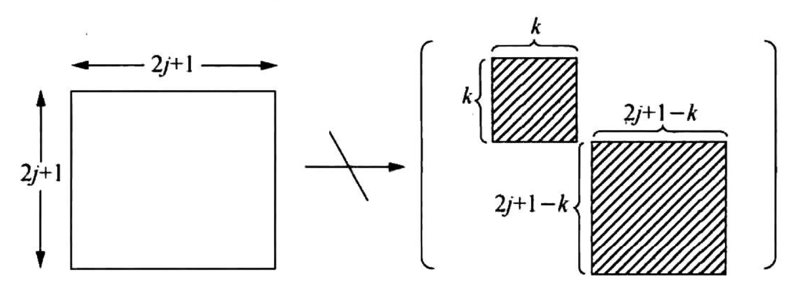

# 球谐函数的旋转性质

## 转动群

考虑三维空间中的转动，保持长度和手性不变，则转动群定义为行列式为1，$R^TR=I$的三阶方阵。转动群有三个自由度，可以用三个参数描述。

转动群有多种参数表示方式。

### 罗德里格斯参数

### 欧拉角

### 

## 转动群的线性表示

矩阵群GL(N)到群G的同态映射称为群G的**线性表示**。

### 不可约表示

### SU2和SO3的关系

## 从转动群到四元数

转动可以用四元数描述，就是因为四元数与转动群的李代数同构。

## 从转动群到球谐函数

球谐函数当然可以可以看作是球坐标下求解拉普拉斯方程的Sturm-Liouville问题时产生的一组基底，但从转动群的角度出发可以更好地看到球谐函数的转动性质。

转动群在无穷维线性群的表示可以以可列的形式进行逐阶约化（这还是依赖于转动群的紧性），约化的要点就是要找到基底。此处我们用函数作为基底。即我们希望找到这样的一个线性空间，以一组函数$f_i(\theta,\phi)$作为基。用数学的形式表达如下：
$$
\mathbf{R}(f_i(\theta,\phi))=\sum_{j}A_{ij}f_j(\theta,\phi)
$$

用通俗的语言来说，就是让一个群的大矩阵表示变得分块，寻找到合适的基底构成一个线性子空间，让群的作用对于此线性子空间封闭。且要求每个小块不能再通过基底变换的方式进一步分块：

对转动群而言，此处再描述基底的寻找方式对读者无益，说少了讲不清楚，说多了就偏离了主题。这里就介绍分块后的结果，自然可以看出和球谐函数的对应关系。

分好块的矩阵如上图所示，从左上到右下第j个子块的大小是$2j+1$，数量与每一阶球谐函数相同。我们依照量子力学中的习惯，将转动R的线性表示的第$j$阶子矩阵中的$m^\prime$行$m$列记作$\mathcal{D}_{m^{\prime} m}^{(j)}(R)$。依据**线性表示的定义**，转动群元的乘积可以在线性群中表示出来：
$$
\sum_{m^{\prime}} \mathcal{D}_{m^{\prime \prime} m^{\prime}}^{(j)}\left(R_{1}\right) \mathcal{D}_{m^{\prime} m}^{(j)}\left(R_{2}\right)=\mathcal{D}_{m^{\prime \prime}  m}^{(j)}\left(R_{1} R_{2}\right)
$$
球谐函数是什么呢？球谐函数$Y_j^m$就是$\mathcal{D}_{m 0}^{(l)}(R)$（或$\mathcal{D}_{0 m}^{(l)}(R)$），就是每一个子块最中间的那一行（或一列）。那么现在如何旋转球谐函数已经非常清楚了。比如，一个函数$f(\theta,\phi)$如果是某一阶球谐函数的线性组合：
$$
f(\theta,\phi)=\sum_ma_mY_l^m(\theta,\phi)
$$
那么旋转后的表示只用将转动的线性表示作用到系数上：
$$
R(f(\theta,\phi))=\sum_mb_mY_l^{m}(\theta,\phi)
$$
其中
$$
b_m=\mathcal{D}_{m m^{\prime}}^{(j)}\left(R\right)a_m^\prime
$$
即矩阵乘在球谐系数矢量上，以新的球谐系数计算即可。

在算法实现方面，主要需要$\mathcal{D}_{m^{\prime} m}^{(j)}(R)$的计算方法。我们这里用一个抽象的$R$来表示转动，但实际计算的时候必然要有一个方式来描述转动。